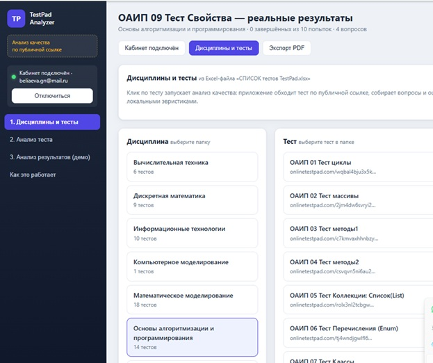
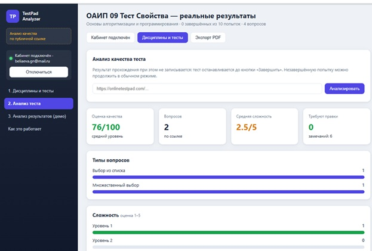
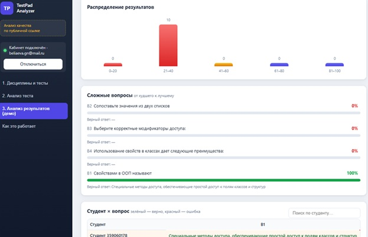

# TestPad Analyzer

Анализ качества тестов и результатов студентов на платформе **Online Test Pad**.

Приложение читает список тестов из Excel-файла, проходит каждый тест по публичной ссылке (не записывая результат), оценивает качество вопросов и — после подключения личного кабинета — показывает разбор реальных ответов студентов: матрицу «студент × вопрос», проблемные вопросы, темы и рекомендации преподавателю.

> Версия: MVP · Дата: 20.08.2026

---

## Оглавление

1. [Зачем это нужно](#зачем-это-нужно)
2. [Возможности](#возможности)
3. [Скриншоты](#скриншоты)
4. [Структура проекта](#структура-проекта)
5. [Требования](#требования)
6. [Установка и запуск](#установка-и-запуск)
7. [Как пользоваться](#как-пользоваться)
8. [Работа с личным кабинетом](#работа-с-личным-кабинетом)
9. [Проверка проекта](#проверка-проекта)
10. [Устранение неполадок](#устранение-неполадок)

---

## Зачем это нужно

Преподаватель составляет тесты на Online Test Pad и хранит их список в файле `СПИСОК тестов TestPad.xlsx`. Задачи, которые решает проект:

- **Контроль качества теста до прохождения.** Пройти тест вручную и просмотреть каждый вопрос — долго. Приложение делает это автоматически и оценивает формулировки, варианты ответов, сложность и соответствие теме.
- **Анализ результатов после прохождения.** Вместо ручного просмотра статистики по каждому вопросу приложение строит матрицу «студент × вопрос» и подсвечивает, где именно ошибались студенты.

**Важно:** обход теста по публичной ссылке останавливается до кнопки «Завершить» — результат не записывается, попытки студентов не портятся.

## Возможности

- Чтение списка тестов из Excel-файла и группировка по дисциплинам.
- Обход теста по публичной ссылке и сбор вопросов с вариантами ответов.
- Оценка качества теста (0–100), сложность каждого вопроса (1–5), типы вопросов, ключевые понятия.
- Рекомендации: что упростить, что усложнить, какие типы вопросов добавить.
- Раздел «Анализ результатов»:
  - демо-режим на встроенных данных (работает без кабинета);
  - загрузка реальной статистики выбранного теста из личного кабинета;
  - сводные метрики, распределение баллов, проблемные вопросы с верными ответами;
  - матрица «студент × вопрос» с подсветкой верно/ошибка/нет ответа;
  - темы и повторяющиеся ошибки, рекомендации преподавателю.
- Экспорт отчёта в PDF (печать через браузер).

## Скриншоты

| Главная и список тестов | Анализ качества теста | Реальные результаты |
| --- | --- | --- |
|  |  |  |

## Структура проекта

```
Task_test/
├── server.py              # Flask-сервер (HTTP API)
├── otp_client.py          # Клиент Online Test Pad (Playwright, worker-поток)
├── analyzer.py            # Локальные эвристики оценки качества теста
├── tests_loader.py        # Чтение Excel → data/tests.json
├── start.bat              # Запуск одной командой (Windows)
├── task2_MVP.md           # Идея и границы MVP
├── task2_project_structure.docx  # Структура проекта
├── task2_verification.docx       # Проверка по критериям финального проекта
├── data/
│   ├── otp_state.json     # Сессия кабинета (cookies, email; пароль не хранится)
│   └── tests.json         # Список тестов (кэш из Excel)
├── static/
│   ├── index.html         # Интерфейс
│   ├── app.js             # Логика фронтенда
│   └── style.css          # Стили (+ print-стили для PDF)
└── СПИСОК тестов TestPad.xlsx  # Входные данные (папка, дисциплина, название, ссылка)
```

## Требования

- Windows 10/11 (проект разрабатывался под Windows).
- Python 3.9+ с добавлением в PATH.
- Браузер Chromium (устанавливается автоматически скриптом запуска).

## Установка и запуск

### Быстрый запуск (рекомендуется)

Дважды щёлкните **`start.bat`**. Скрипт сам:

1. проверит Python;
2. установит зависимости (`flask`, `pandas`, `openpyxl`, `playwright`);
3. установит браузер Chromium;
4. запустит сервер и откроет `http://127.0.0.1:5000` в браузере.

### Запуск вручную

```bash
pip install flask pandas openpyxl playwright
python -m playwright install chromium
python server.py
```

Затем откройте **http://127.0.0.1:5000**.

## Как пользоваться

### 1. Дисциплины и тесты

На главной странице выберите дисциплину (папку), затем тест. Клик по тесту запускает анализ качества — обход теста по публичной ссылке занимает до минуты.

### 2. Анализ теста

Здесь можно вставить произвольную ссылку на тест Online Test Pad и нажать **«Анализировать»**. Результат: оценка качества, типы вопросов, сложность, ключевые понятия, рекомендации и полный список вопросов с вердиктами.

### 3. Анализ результатов

- По умолчанию показывает тест, выбранный в разделе 1 (если он проанализирован), или встроенный демо-тест из выпадающего списка.
- Кнопка **«Загрузить реальные результаты из кабинета»** загружает настоящую статистику по выбранному тесту (нужно подключение кабинета).
- Кнопка **«Вернуть демо-данные»** возвращает демо-режим.

### Экспорт PDF

Кнопка **«Экспорт PDF»** в шапке открывает диалог печати браузера — выберите «Сохранить как PDF» для получения отчёта по текущему разделу.

## Работа с личным кабинетом

Для загрузки реальной статистики нужен аккаунт преподавателя на onlinetestpad.com.

1. Нажмите **«Подключить кабинет»** (или в шапке «Кабинет подключён»).
2. Введите e-mail и пароль. Пароль используется только для входа в браузерную сессию приложения и **нигде не сохраняется**.
3. После входа статус сменится на «Кабинет подключён · ваш-email@mail.ru».
4. Сессия сохраняется в `data/otp_state.json` и восстанавливается при следующем запуске.
5. Для выхода нажмите **«Отключиться»** — сохранённая сессия удаляется.

Особенности работы со статистикой:

- Публичный идентификатор теста в ссылке **не совпадает** с идентификатором в кабинете — приложение сопоставляет тесты по названию.
- Процент верных ответов пересчитывается по ключу ответов из редактора вопросов, поэтому незавершённые попытки не завышаются.
- Поддерживаются и тесты с вопросами «выбор варианта», и тесты с вопросами «ввод ответа».

## Проверка проекта

- `task2_verification.docx` — проверка по критериям финального проекта (понятность, полезность, завершённость, демонстрируемость, реальность, сроки).
- `task2_MVP.md` — идея и осознанные границы первой версии.
- `task2_project_structure.docx` — структура проекта (название, проблема, пользователь, функции, результат, минимальный функционал, технологии).

## Устранение неполадок

| Проблема | Решение |
| --- | --- |
| Окно запуска закрывается сразу | Запустите `cmd`, перейдите в папку проекта и выполните `python server.py` — увидите текст ошибки. |
| «Python not found» | Установите Python с python.org и отметьте «Add Python to PATH». |
| Ошибка при входе в кабинет | Проверьте e-mail/пароль и интернет. Убедитесь, что капча/двухфакторка не блокируют вход. |
| Не загружается статистика | Убедитесь, что кабинет подключён и выбран нужный тест в разделе 1. |
| Порт 5000 занят | Закройте другой сервер или запустите приложение на другом порту: `python server.py` после правки порта в `server.py`. |

---

© 2026 · TestPad Analyzer
